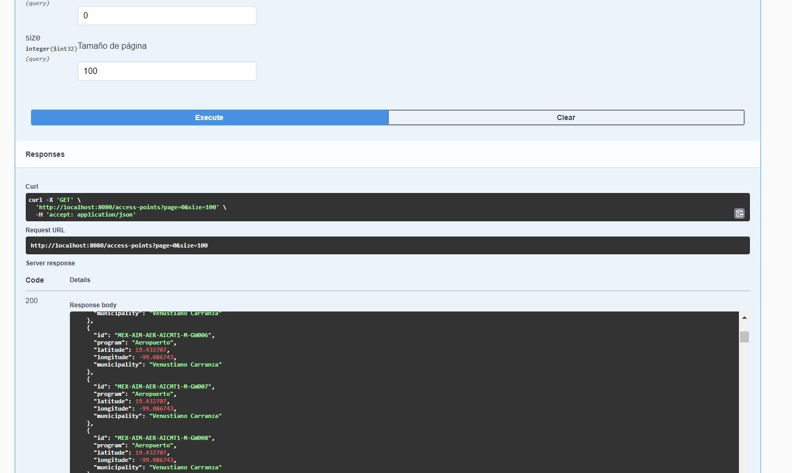
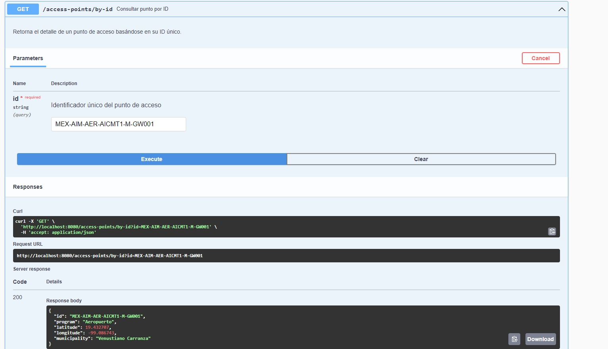
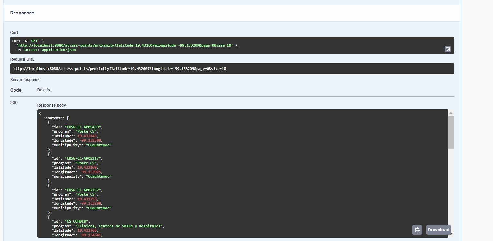
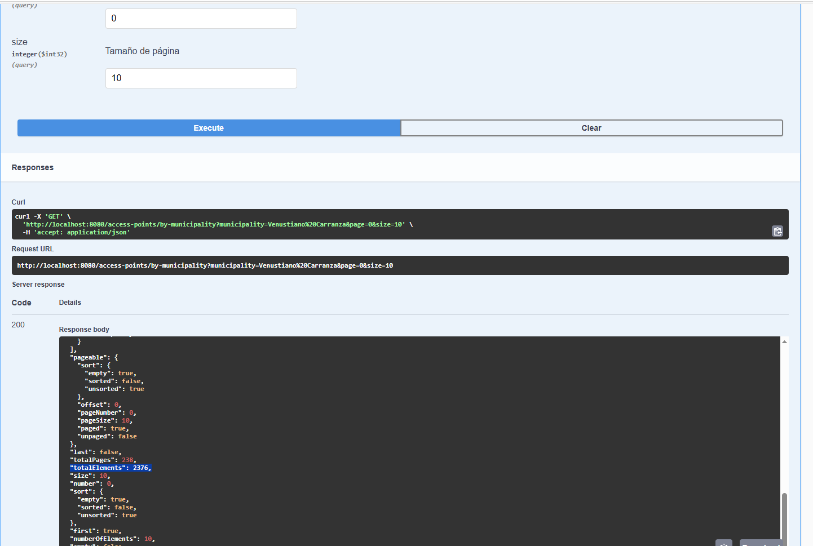
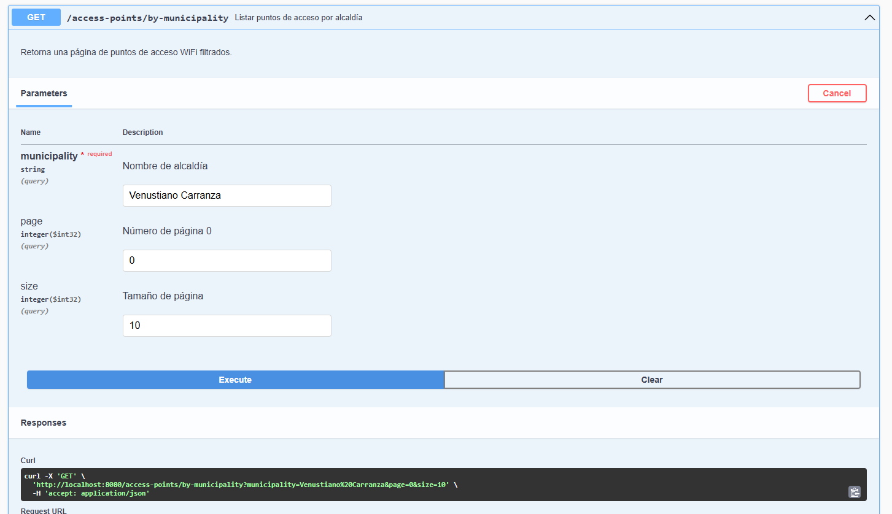
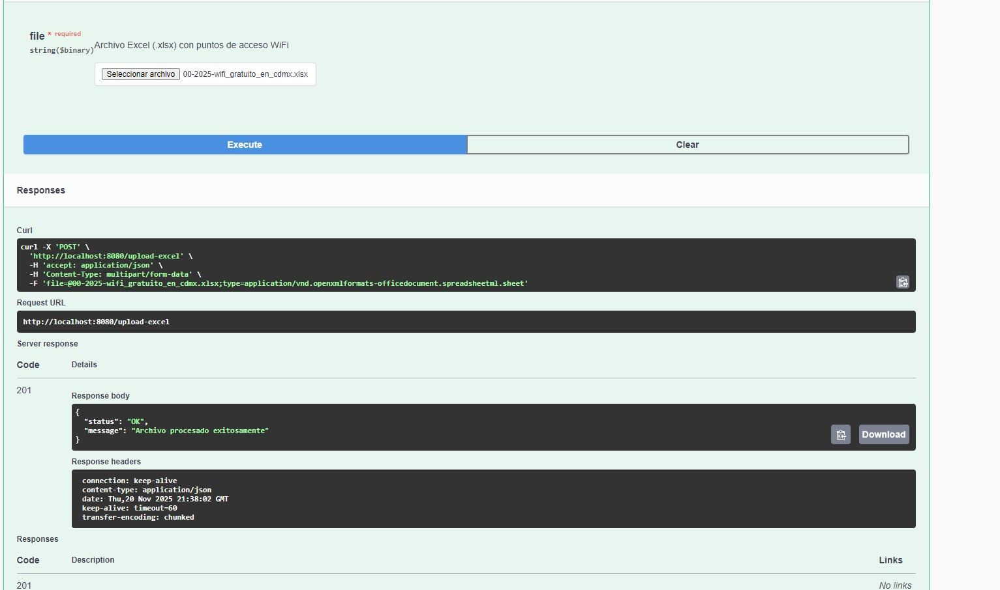
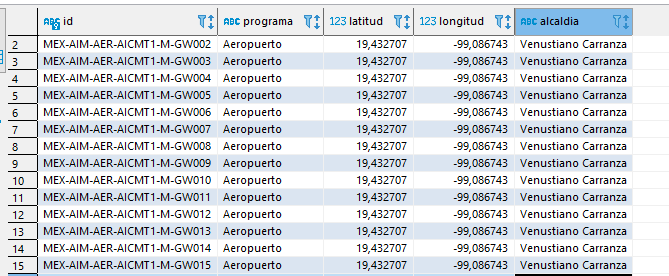

# wifi-hotspot-app

Descripción
---
wifi-hotspot-app es una aplicación que consulta y expone los puntos de acceso Wi‑Fi de la Ciudad de México. Los registros se importan desde un archivo Excel ubicado en la raíz del repositorio (00-2025-wifi_gratuito_en_cdmx.xlsx) y se almacenan en la base de datos para quedar disponibles a través de los servicios REST que ofrece la aplicación.

Tecnologías y versiones
---
- Java 17
- Spring Boot 2.7.9
- Maven 3.9.x
- PostgreSQL 16
- Spring Batch (procesamiento por lotes)
- Pruebas: JUnit 5 y Mockito
- Documentación API: Swagger UI disponible en http://localhost:8080/swagger-ui/index.html

Requisitos previos
---
1. Tener PostgreSQL instalado y accesible.  
2. Crear una base de datos con el nombre: `hotspots-wifi`.  
3. La tabla `access_point` y la estructura requerida están en el script: `/initdb/schema.sql` (se ejecuta automáticamente cuando se usa docker-compose, o puede ejecutarse manualmente contra la BD).

Clonar el repositorio
---
git clone https://github.com/daytolp/wifi-hotspot.git

Compilación
---
Compilar la aplicación desde consola:
mvn clean install

Importar en un IDE
---
Se recomienda usar IntelliJ IDEA:
1. Abrir IntelliJ -> Import Project -> seleccionar el directorio del proyecto.
2. Dejar la configuración por defecto para Maven/Java 17.

Ejecución local
---
1. Verificar que la base de datos `hotspots-wifi` esté disponible y que las credenciales en `src/main/resources/application.properties` sean correctas.  
2. Ejecutar la clase principal `WifiHotspotAppApplication.java` desde el IDE o con:
   mvn spring-boot:run

Docker (arranque rápido)
---
El proyecto incluye un `Dockerfile` y `docker-compose.yml` para facilitar el despliegue. Después de clonar el repositorio, ejecutar:
docker-compose up -d --build

Esto levantará un contenedor de PostgreSQL, ejecutará el script `schema.sql` para crear la tabla `access_point` y construirá la aplicación.

Importar datos desde Excel
---
El archivo `00-2025-wifi_gratuito_en_cdmx.xlsx` en la raíz del repositorio contiene los registros de puntos de acceso. La aplicación cuenta con un endpoint (tipo POST) para cargar el archivo y con un job de Spring Batch que procesa e inserta los registros en la BD por lotes.

Pruebas y documentación
---
- Las pruebas unitarias están implementadas con JUnit 5 y Mockito.  
- La API pública está documentada con Swagger: http://localhost:8080/swagger-ui/index.html

Colección Postman
---
En el proyecto se incluye la colección `WIFI-Hotspot.postman_collection.json` (Collection v2.1). Importa esta colección en Postman para probar los endpoints.  
- El endpoint POST se usa para cargar el archivo Excel.  
- Los demás endpoints permiten consultar la información de acuerdo con los requisitos de la prueba técnica.

Notas finales
---
- Asegúrate de que las credenciales y URL de la base de datos en `application.properties` coincidan con tu entorno antes de arrancar la aplicación.  

Evidencias de funcionamiento en Swagger UI
---
A continuación se incluyen capturas de la carpeta `docs/` que evidencian el correcto funcionamiento de los 5 endpoints expuestos en Swagger UI y la inserción de registros en la base de datos.

- 1) Endpoint: Listar todos los puntos de acceso (GET)

Descripción: Muestra la definición del endpoint para obtener todos los access points y ejemplo de respuesta.

- 2) Endpoint: Consultar por id (GET)

Descripción: Evidencia del endpoint GET /access-points/by-id con parámetros y ejemplo de respuesta.

- 3) Endpoint: Búsqueda por proximidad (GET)

Descripción: Muestra la operación que devuelve puntos de acceso ordenados por cercanía al punto dado.

- 4) Endpoint: Búsqueda por alcaldía (GET)

Descripción: Captura del endpoint que devuelve resultados filtrados por alcaldía.

- 5) Endpoint: Carga de archivo (POST)

Descripción: Evidencia del endpoint POST para subir el archivo Excel y disparar el procesamiento (job de Spring Batch).

Registros insertados en la base de datos
---

Descripción: Captura de la tabla `access_point` mostrando que los registros del archivo Excel fueron insertados correctamente.

Nota
---
Todas las consultas que devuelven un listado traen el total de registros en la respuesta en el campo "totalElements".